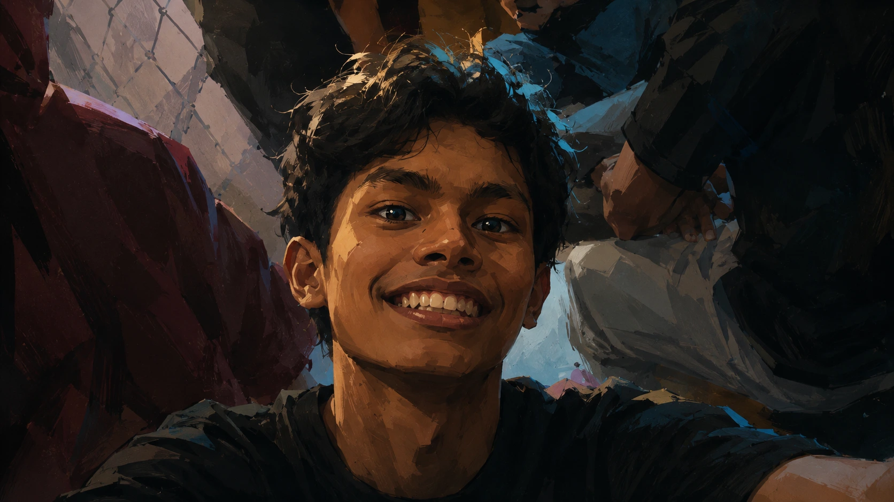
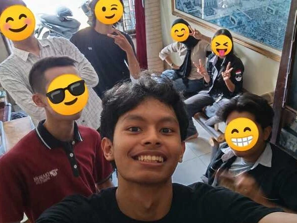

  <!-- Hero Background Image Banner -->
  

 

<table align="center" width="100%">
  <tr>
    <td width="65%" valign="top">
      <h2 style="font-family: 'Outfit', sans-serif; margin-top: 0;">👋 Hi, I'm Huddin</h2>
      

        <b>Sholahuddin Ahmad</b> (<i>Huddin</i>) is a programmer based in <b>Magelang, Central Java, ID</b> 📍 — known for clean and expressive code — who also designs the brand.
      

      

        Building high-performance web applications with clean architecture, smooth micro-interactions, and visual coherence.
      

       
      

        
        
        
      

    </td>
    <td width="35%" align="center" valign="middle">
      
       
      🎵 <b>STRUCT</b> — by UDIENNX
    </td>
  </tr>
</table>

<table align="center" width="100%">
  <tr>
    <td width="50%" align="center">
      
       
      <b>Sholahuddin Ahmad</b> — Coder & Designer
    </td>
    <td width="50%" align="center">
      
       
      <b>Magelang</b> — Central Java, ID
    </td>
  </tr>
</table>

---

<table align="center" width="100%">
  <tr>
    <td width="35%" align="center" valign="middle">
      
    </td>
    <td width="65%" valign="middle">
      <h2 style="font-family: 'Outfit', sans-serif;">Mau bikin apa nih?</h2>
      
<b>Topics I'm Interested In:</b>

      

        
        
        
         
        
        
        
         
        
        
        
      

    </td>
  </tr>
</table>

  

    
    
    
    
     
    
    
    
    <img src="https://img.shields.io/badge/OpenAI-412991?style=for-the-badge&logo=data:image/svg%2Bxml;base64,PHN2ZyBmaWxsPSJ3aGl0ZSIgcm9sZT0iaW1nIiB2aWV3Qm94PSIwIDAgMjQgMjQiIHhtbG5zPSJodHRwOi8vd3d3LnczLm9yZy8yMDAwL3N2ZyI+PHRpdGxlPk9wZW5BSSBHeW08L3RpdGxlPjxwYXRoIGQ9Ik0yNCA5LjczNlY5LjcyYzAtLjAxOC0uMDA5LS4wMzUtLjAwOS0uMDUzLS4wMDgtLjAxNy0uMDA4LS4wMzQtLjAxNy0uMDUyIDAtLjAwOS0uMDA5LS4wMDktLjAwOS0uMDE3YS4xOS4xOSAwIDAgMC0uMDI2LS4wNDR2LS4wMDljLS4wMDktLjAxNy0uMDI2LS4wMjYtLjA0NC0uMDQzbC0uMDA4LS4wMDljLS4wMTgtLjAwOS0uMDM1LS4wMjYtLjA1My0uMDM1bC0zLjcyLTIuMTQzVjMuMDJjMC0uMDE4IDAtLjA0NC0uMDA4LS4wNjFWMi45NGEuMTI0LjEyNCAwIDAgMC0uMDE3LS4wNTJWMi44OGMtLjAxLS4wMTctLjAxOC0uMDM1LS4wMjctLjA0MyAwLS4wMS0uMDA4LS4wMS0uMDA4LS4wMWEuMTkuMTkgMCAwIDAtLjAzNS0uMDQzYy0uMDE4LS4wMDgtLjAyNi0uMDI2LS4wNDQtLjAzNC0uMDA4IDAtLjAwOC0uMDEtLjAxNy0uMDFsLS4wMDktLjAwOEwxNi4wNTUuNDc2YS4zMzguMzM4IDAgMCAwLS4zNCAwbC0zLjcyIDIuMTQzTDguNzg2LjQ3NmEuMzM4LjMzOCAwIDAgMC0uMzQgMEw0LjA2IDIuNzIzYy0uMDEgMC0uMDEuMDEtLjAxLjAxLS4wMDggMC0uMDA4LjAwOC0uMDE3LjAwOC0uMDE3LjAwOS0uMDI2LjAyNi0uMDQzLjAzNWEuMTUzLjE1MyAwIDAgMC0uMDM1LjA0M2wtLjAwOS4wMDljLS4wMDguMDE3LS4wMTcuMDI2LS4wMjYuMDQ0di4wMDhjLS4wMDkuMDE4LS4wMDkuMDM1LS4wMTcuMDUydi4wMThjMCAuMDE3LS4wMDkuMDQzLS4wMDkuMDZ2NC4yOTZMLjE2NiA5LjQ1N2MtLjAxOC4wMS0uMDM1LjAyNi0uMDUzLjAzNWwtLjAwOC4wMDktLjA0NC4wNDN2LjAxYy0uMDA5LjAxNy0uMDE3LjAyNS0uMDI2LjA0MyAwIC4wMDgtLjAwOS4wMDgtLjAwOS4wMTdhLjEyNC4xMjQgMCAwIDAtLjAxNy4wNTJDMCA5LjY4NCAwIDkuNzAxIDAgOS43MnY0LjUyMWEuMzQuMzQgMCAwIDAgLjE2Ni4yOTZsMy43MiAyLjE4M3Y0LjI5NWEuMzQuMzQgMCAwIDAgLjE2NS4yOTZsMy44ODUgMi4yNDhjLjAwOS4wMDguMDE4LjAwOC4wMjYuMDE3IDAgMCAuMDA5IDAgLjAwOS4wMDkuMDA5IDAgLjAxNy4wMDguMDI2LjAwOC4wMDkgMCAuMDA5IDAgLjAxOC4wMS4wMDggMCAuMDE3IDAgLjAyNi4wMDhoLjA2MWEuMzUuMzUgMCAwIDAgLjEzLS4wMjZjLjAxOC0uMDA5LjAyNi0uMDA5LjA0NC0uMDE4bDMuNzItMi4xNDMgMy43MiAyLjE4M3Y0LjI5NWEuMzQuMzQgMCAwIDAgLjEzLjA0NmguMDYyYy4wMDggMCAuMDE3IDAgLjAyNi0uMDA5LjAwOCAwIC4wMDggMCAuMDE3LS4wMDkuMDA5IDAgLjAxOC0uMDA4LjAyNi0uMDA4LjAwOSAwIC4wMDkgMCAuMDA5LS4wMDkuMDA5IDAgLjAxNy0uMDA5LjAyNi0uMDE3bDMuODg1LTIuMjQ4YS4zNC4zNCAwIDAgMCAuMTY2LS4yOTZWMTYuNjhsMy43Mi0yLjE0M2EuMzQuMzQgMCAwIDAgLjE2NS0uMjk2VjkuNzU0Yy4wMDktLjAxLjAwOS0uMDE4LjAwOS0uMDE4ek0xMi4xNyAyMC42N3MtLjAwOSAwLS4wMDktLjAwOWMtLjAwOS0uMDA4LS4wMTctLjAwOC0uMDM1LS4wMTctLjAwOCAwLS4wMTctLjAwOS0uMDI2LS4wMDktLjAwOSAwLS4wMTctLjAwOS0uMDM1LS4wMDktLjAwOCAwLS4wMjYtLjAwOC0uMDM1LS4wMDhoLS4wNjljLS4wMDkgMC0uMDI2IDAtLjAzNS4wMDgtLjAwOSAwLS4wMTcgMC0uMDM1LjAxLS4wMDkgMC0uMDE3LjAwOC0uMDI2LjAwOC0uMDA5LjAwOS0uMDE3LjAwOS0uMDM1LjAxNyAwIDAtLjAwOCAwLS4wMDguMDA5bC0zLjM3IDEuOTUxdi0zLjcwMmMzLjU0NS0yLjA0NyAzLjU0NSAyLjA0N3YzLjcwMnpNNC40IDcuNzkzYy4wMTctLjAxNy4wMjUtLjAyNi4wMzQtLjAyNi4wMDktLjAwOC4wMTgtLjAwOC4wMjYtLjAxN2wuMDI2LS4wMjZjLjAxLS4wMDkuMDE4LS4wMTguMDE4LS4wMjYuMDA5LS4wMS4wMDktLjAxOC4wMTctLjAyNi4wMDktLjAxLjAwOS0uMDE4LjAxOC0uMDI3LjAwOC0uMDA4LjAwOC0uMDE3LjAwOC0uMDM0IDAtLjAxLjAxLS4wMTguMDEtLjAzNSAwLS4wMDkgMC0uMDE4LjAwOC0uMDM1VjMuNjAzTDcuNzcgNS40NnY0LjA5NEw0LjIyNSAxMS42IDEuMDIgOS43NDV6bTcuNTk2LTQuMzgxbDMuNTQ1IDIuMDQ3VjkuMTZsLTMuMzgtMS45NTFzLS4wMDkgMC0uMDA5LS4wMDljLS4wMDgtLjAwOS0uMDE3LS4wMDktLjAzNC0uMDE3LS4wMSAwLS4wMTgtLjAwOS0uMDI3LS4wMDktLjAwOCAwLS4wMTctLjAwOS0uMDM0LS4wMDktLjAxIDAtLjAxOC0uMDA4LS4wMzUtLjAwOGgtLjA3Yy0uMDA5IDAtLjAyNiAwLS4wMzUuMDA4LS4wMDggMC0uMDE3IDAtLjAzNS4wMDktLjAwOCAwLS4wMTcuMDA5LS4wMjYuMDA5LS4wMDguMDA4LS4wMjYuMDA4LS4wMzUuMDE3IDAgMC0uMDA4IDAtLjAwOC4wMDlMEDguNDUgOS4xNnYtMy43em0wIDEyLjY3NUw4LjQ5IDE0LjA0VjkuOTQ1bDMuNTQ2LTIuMDQ3IDMuNTQ1IDIuMDQ3djQuMDk1em0tNy40MzEtMy45MDNsMy4yMDYtMS44NTZ2My45NDdjMCAuMDA4IDAgLjAxNy4wMDguMDM1IDAgLjAwOC4wMDkuMDE3LjAwOS4wMzQgMCAuMDEuMDA5LjAxOC4wMDkuMDM1LjAwOC4wMDkuMDA4LjAxOC4wMTcuMDI2LjAwOS4wMS4wMDkuMDE4LjAxOC4wMjcuMDA4LjAwOC4wMTcuMDE3LjAxNy4wMjZsLjAyNi4wMjZjLjAwOS4wMDkuMDE4LjAxNy4wMjYuMDE3LjAwOS4wMDkuMDE4LjAxOC4wMjYuMDE4bC4wMS4wMDggMy4zOCAxLjk1Mi0zLjIwNyAxLjg1NS0zLjU0NS0yLjA0N3ptMTEuMzI1IDYuMTVsLTMuMjA2LTEuODU1IDMuMzgtMS45NTIuMDA5LS4wMDhjLjAwOC0uMDA5LjAxNy0uMDE4LjAyNi0uMDE4LjAwOC0uMDA4LjAxNy0uMDA4LjAyNi0uMDE3bC4wMjYtLjAyNmMuMDA5LS4wMDkuMDE3LS4wMTguMDE3LS4wMjYuMDEtLjAxLjAxLS4wMTguMDE4LS4wMjcuMDA5LS4wMDguMDA5LS4wMTcuMDE3LS4wMjYuMDA5LS4wMDguMDA5LS4wMTcuMDA5LS4wMzUgMC0uMDA4LjAwOS0uMDE3LjAwOS0uMDM0IDAtLjAxIDAtLjAxOC4wMDgtLjAzNXYtMy45NDdsMy4yMDYgMS44NTZ2NC4wOTR6bTMuODg1LTYuNzM0bC0zLjU0Ni0yLjA0N1Y1LjQ2bDMuMjA2LTEuODU2VjcuNTVjMCAuMDA4IDAgLjAxNy4wMDkuMDM0IDAgLjAxLjAwOS4wMTguMDA5LjAzNSAwIC4wMDkuMDA4LjAxOC4wMDguMDM1LjAxLjAwOS4wMS4wMTguMDE4LjAyNi4wMDguMDA5LjAwOC4wMTguMDE3LjAyNi4wMDkuMDEuMDE4LjAxOC4wMTguMDI2LjAwOC4wMS4wMTcuMDE4LjAyNi4wMjcuMDA4LjAwOC4wMTcuMDE3LjAyNi4wMTcuMDA5LjAwOS4wMTcuMDE3LjAyNi4wMTdsLjAwOS4wMSAzLjM4IDEuOTV6TTE1Ljg5IDEuMTY0bDMuMjA1IDEuODU2LTMuMjA1IDEuODU1LTMuMjA2LTEuODU1em0tNy43OCAwbDMuMjA2IDEuODU2TDguNTEgNC44NjYgNC45MDUgMy4wMnpNLjY4IDEwLjMzN2wzLjIwNSAxLjg1NnYzLjcwMkwuNjggMTQuMDR6TTcuNzcgMjIuNjJsLTMuMjA1LTEuODU1di0zLjcwM2zLjIwNiAxLjg1NnptMTEuNjY1LTEuODQ2bC0zLjIwNiAxLjg1NXYtMy43MDJsMy4yMDYtMS44NTZaIi8+PC9zdmc+" />
  

---

  

    
  

  

    
    <img src="https://img.shields.io/badge/Codex-000000?style=for-the-badge&logo=data:image/svg%2Bxml;base64,PHN2ZyBmaWxsPSJ3aGl0ZSIgcm9sZT0iaW1nIiB2aWV3Qm94PSIwIDAgMjQgMjQiIHhtbG5zPSJodHRwOi8vd3d3LnczLm9yZy8yMDAwL3N2ZyI+PHRpdGxlPk9wZW5BSSBHeW08L3RpdGxlPjxwYXRoIGQ9Ik0yNCA5LjczNlY5LjcyYzAtLjAxOC0uMDA5LS4wMzUtLjAwOS0uMDUzLS4wMDgtLjAxNy0uMDA4LS4wMzQtLjAxNy0uMDUyIDAtLjAwOS0uMDA5LS4wMDktLjAwOS0uMDE3YS4xOS4xOSAwIDAgMC0uMDI2LS4wNDR2LS4wMDljLS4wMDktLjAxNy0uMDI2LS4wMjYtLjA0NC0uMDQzbC0uMDA4LS4wMDljLS4wMTgtLjAwOS0uMDM1LS4wMjYtLjA1My0uMDM1bC0zLjcyLTIuMTQzVjMuMDJjMC0uMDE4IDAtLjA0NC0uMDA4LS4wNjFWMi45NGEuMTI0LjEyNCAwIDAgMC0uMDE3LS4wNTJWMi44OGMtLjAxLS4wMTctLjAxOC0uMDM1LS4wMjctLjA0MyAwLS4wMS0uMDA4LS4wMS0uMDA4LS4wMWEuMTkuMTkgMCAwIDAtLjAzNS0uMDQzYy0uMDE4LS4wMDgtLjAyNi0uMDI2LS4wNDQtLjAzNC0uMDA4IDAtLjAwOC0uMDEtLjAxNy0uMDFsLS4wMDktLjAwOEwxNi4wNTUuNDc2YS4zMzguMzM4IDAgMCAwLS4zNCAwbC0zLjcyIDIuMTQzTDguNzg2LjQ3NmEuMzM4LjMzOCAwIDAgMC0uMzQgMEw0LjA2IDIuNzIzYy0uMDEgMC0uMDEuMDEtLjAxLjAxLS4wMDggMC0uMDA4LjAwOC0uMDE3LjAwOC0uMDE3LjAwOS0uMDI2LjAyNi0uMDQzLjAzNWEuMTUzLjE1MyAwIDAgMC0uMDM1LjA0M2wtLjAwOS4wMDljLS4wMDguMDE3LS4wMTcuMDI2LS4wMjYuMDQ0di4wMDhjLS4wMDkuMDE4LS4wMDkuMDM1LS4wMTcuMDUydi4wMThjMCAuMDE3LS4wMDkuMDQzLS4wMDkuMDZ2NC4yOTZMLjE2NiA5LjQ1N2MtLjAxOC4wMS0uMDM1LjAyNi0uMDUzLjAzNWwtLjAwOC4wMDktLjA0NC4wNDN2LjAxYy0uMDA5LjAxNy0uMDE3LjAyNS0uMDI2LjA0MyAwIC4wMDgtLjAwOS4wMDgtLjAwOS4wMTdhLjEyNC4xMjQgMCAwIDAtLjAxNy4wNTJDMCA5LjY4NCAwIDkuNzAxIDAgOS43MnY0LjUyMWEuMzQuMzQgMCAwIDAgLjE2Ni4yOTZsMy43MiAyLjE4M3Y0LjI5NWEuMzQuMzQgMCAwIDAgLjE2NS4yOTZsMy44ODUgMi4yNDhjLjAwOS4wMDguMDE4LjAwOC4wMjYuMDE3IDAgMCAuMDA5IDAgLjAwOS4wMDkuMDA5IDAgLjAxNy4wMDguMDI2LjAwOC4wMDkgMCAuMDA5IDAgLjAxOC4wMS4wMDggMCAuMDE3IDAgLjAyNi4wMDhoLjA2MWEuMzUuMzUgMCAwIDAgLjEzLS4wMjZjLjAxOC0uMDA5LjAyNi0uMDA5LjA0NC0uMDE4bDMuNzItMi4xNDMgMy43MiAyLjE4M3Y0LjI5NWEuMzQuMzQgMCAwIDAgLjEzLjA0NmguMDYyYy4wMDggMCAuMDE3IDAgLjAyNi0uMDA5LjAwOCAwIC4wMDggMCAuMDE3LS4wMDkuMDA5IDAgLjAxOC0uMDA4LjAyNi0uMDA4LjAwOSAwIC4wMDkgMCAuMDA5LS4wMDkuMDA5IDAgLjAxNy0uMDA5LjAyNi0uMDE3bDMuODg1LTIuMjQ4YS4zNC4zNCAwIDAgMCAuMTY2LS4yOTZWMTYuNjhsMy43Mi0yLjE0M2EuMzQuMzQgMCAwIDAgLjE2NS0uMjk2VjkuNzU0Yy4wMDktLjAxLjAwOS0uMDE4LjAwOS0uMDE4ek0xMi4xNyAyMC42N3MtLjAwOSAwLS4wMDktLjAwOWMtLjAwOS0uMDA4LS4wMTctLjAwOC0uMDM1LS4wMTctLjAwOCAwLS4wMTctLjAwOS0uMDI2LS4wMDktLjAwOSAwLS4wMTctLjAwOS0uMDM1LS4wMDktLjAwOCAwLS4wMjYtLjAwOC0uMDM1LS4wMDhoLS4wNjljLS4wMDkgMC0uMDI2IDAtLjAzNS4wMDgtLjAwOSAwLS4wMTcgMC0uMDM1LjAxLS4wMDkgMC0uMDE3LjAwOC0uMDI2LjAwOC0uMDA5LjAwOS0uMDE3LjAwOS0uMDM1LjAxNyAwIDAtLjAwOCAwLS4wMDguMDA5bC0zLjM3IDEuOTUxdi0zLjcwMmMzLjU0NS0yLjA0NyAzLjU0NSAyLjA0N3YzLjcwMnpNNC40IDcuNzkzYy4wMTctLjAxNy4wMjUtLjAyNi4wMzQtLjAyNi4wMDktLjAwOC4wMTgtLjAwOC4wMjYtLjAxN2wuMDI2LS4wMjZjLjAxLS4wMDkuMDE4LS4wMTguMDE4LS4wMjYuMDA5LS4wMS4wMDktLjAxOC4wMTctLjAyNi4wMDktLjAxLjAwOS0uMDE4LjAxOC0uMDI3LjAwOC0uMDA4LjAwOC0uMDE3LjAwOC0uMDM0IDAtLjAxLjAxLS4wMTguMDEtLjAzNSAwLS4wMDkgMC0uMDE4LjAwOC0uMDM1VjMuNjAzTDcuNzcgNS40NnY0LjA5NEw0LjIyNSAxMS42IDEuMDIgOS43NDV6bTcuNTk2LTQuMzgxbDMuNTQ1IDIuMDQ3VjkuMTZsLTMuMzgtMS45NTFzLS4wMDkgMC0uMDA5LS4wMDljLS4wMDgtLjAwOS0uMDE3LS4wMDktLjAzNC0uMDE3LS4wMSAwLS4wMTgtLjAwOS0uMDI3LS4wMDktLjAwOCAwLS4wMTctLjAwOS0uMDM0LS4wMDktLjAxIDAtLjAxOC0uMDA4LS4wMzUtLjAwOGgtLjA3Yy0uMDA5IDAtLjAyNiAwLS4wMzUuMDA4LS4wMDggMC0uMDE3IDAtLjAzNS4wMDktLjAwOCAwLS4wMTcuMDA5LS4wMjYuMDA5LS4wMDguMDA4LS4wMjYuMDA4LS4wMzUuMDE3IDAgMC0uMDA4IDAtLjAwOC4wMDlMEDguNDUgOS4xNnYtMy43em0wIDEyLjY3NUw4LjQ5IDE0LjA0VjkuOTQ1bDMuNTQ2LTIuMDQ3IDMuNTQ1IDIuMDQ3djQuMDk1em0tNy40MzEtMy45MDNsMy4yMDYtMS44NTZ2My45NDdjMCAuMDA4IDAgLjAxNy4wMDguMDM1IDAgLjAwOC4wMDkuMDE3LjAwOS4wMzQgMCAuMDEuMDA5LjAxOC4wMDkuMDM1LjAwOC4wMDkuMDA4LjAxOC4wMTcuMDI2LjAwOS4wMS4wMDkuMDE4LjAxOC4wMjcuMDA4LjAwOC4wMTcuMDE3LjAxNy4wMjZsLjAyNi4wMjZjLjAwOS4wMDkuMDE4LjAxNy4wMjYuMDE3LjAwOS4wMDkuMDE4LjAxOC4wMjYuMDE4bC4wMS4wMDggMy4zOCAxLjk1Mi0zLjIwNyAxLjg1NS0zLjU0NS0yLjA0N3ptMTEuMzI1IDYuMTVsLTMuMjA2LTEuODU1IDMuMzgtMS45NTIuMDA5LS4wMDhjLjAwOC0uMDA5LjAxNy0uMDE4LjAyNi0uMDE4LjAwOC0uMDA4LjAxNy0uMDA4LjAyNi0uMDE3bC4wMjYtLjAyNmMuMDA5LS4wMDkuMDE3LS4wMTguMDE3LS4wMjYuMDEtLjAxLjAxLS4wMTguMDE4LS4wMjcuMDA5LS4wMDguMDA5LS4wMTcuMDE3LS4wMjYuMDA5LS4wMDguMDA5LS4wMTcuMDA5LS4wMzUgMC0uMDA4LjAwOS0uMDE3LjAwOS0uMDM0IDAtLjAxIDAtLjAxOC4wMDgtLjAzNXYtMy45NDdsMy4yMDYgMS44NTZ2NC4wOTR6bTMuODg1LTYuNzM0bC0zLjU0Ni0yLjA0N1Y1LjQ2bDMuMjA2LTEuODU2VjcuNTVjMCAuMDA4IDAgLjAxNy4wMDkuMDM0IDAgLjAxLjAwOS4wMTguMDA5LjAzNSAwIC4wMDkuMDA4LjAxOC4wMDguMDM1LjAxLjAwOS4wMS4wMTguMDE4LjAyNi4wMDguMDA5LjAwOC4wMTguMDE3LjAyNi4wMDkuMDEuMDE4LjAxOC4wMTguMDI2LjAwOC4wMS4wMTcuMDE4LjAyNi4wMjcuMDA4LjAwOC4wMTcuMDE3LjAyNi4wMTcuMDA5LjAwOS4wMTcuMDE3LjAyNi4wMTdsLjAwOS4wMSAzLjM4IDEuOTV6TTE1Ljg5IDEuMTY0bDMuMjA1IDEuODU2LTMuMjA1IDEuODU1LTMuMjA2LTEuODU1em0tNy43OCAwbDMuMjA2IDEuODU2TDguNTEgNC44NjYgNC45MDUgMy4wMnpNLjY4IDEwLjMzN2wzLjIwNSAxLjg1NnYzLjcwMkwuNjggMTQuMDR6TTcuNzcgMjIuNjJsLTMuMjA1LTEuODU1di0zLjcwM2zLjIwNiAxLjg1NnptMTEuNjY1LTEuODQ2bC0zLjIwNiAxLjg1NXYtMy43MDJsMy4yMDYtMS44NTZaIi8+PC9zdmc+" />
    
  

---

<!-- Contact Section -->

  <h3 style="font-family: 'Outfit', sans-serif;">
    <i>"Feel Free To Reach Out — Whether It's About A Project Or Just To Say Hi"</i>
  </h3>
  
You'll usually find me designing something, testing an idea, or sharing notes from the process.

   

  

    
    
    
    
  

  

    
    
    
  

---

<!-- Footer Section -->
<table align="center" width="100%">
  <tr>
    <td width="50%" valign="top">
      <h4 style="font-family: 'Outfit', sans-serif;">Sholahuddin Ahmad</h4>
      
Coder and designer focused on bold, modern branding.

      
✉️ <a href="mailto:halohuddin@gmail.com">halohuddin@gmail.com</a>

    </td>
    <td width="50%" align="right" valign="top">
      
© 2025 JULIAN Template. ™ 2027 HaloHuddin Project.

      
Built in <b>Framer & Antigravity</b> MADE BY <a href="https://tmpl.digital/">TMPL</a>

    </td>
  </tr>
</table>

 

  <h1 style="font-family: 'Outfit', sans-serif; letter-spacing: -1px;">SHOLAHUDDIN AHMAD</h1>

