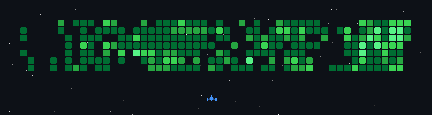
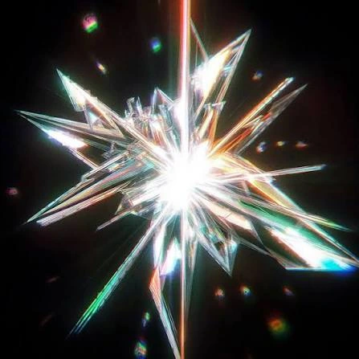
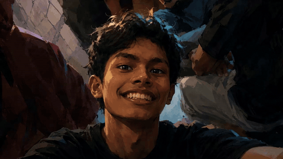
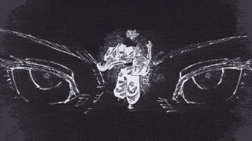
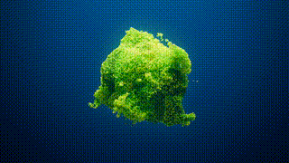

  

 

<table align="center" width="100%">
  <tr>
    <td width="65%" valign="top">
      <h2 style="font-family: 'Outfit', sans-serif; margin-top: 0;">👋 Halo kak Hudin</h2>
      

        <b>Sholahuddin Ahmad</b> (<i>Huddin</i>) is a programmer based in <b>Magelang, Central Java, ID</b> 📍 — known for clean and expressive code — who also designs the brand.
      

      

        Building high-performance web applications with clean architecture, smooth micro-interactions, and visual coherence.
      

       
      

        
        
        
      

    </td>
    <td width="35%" align="center" valign="middle">
      
       
      🎵 <b>STRUCT</b> — by UDIENNX
    </td>
  </tr>
</table>

<table align="center" width="100%">
  <tr>
    <td width="33%" align="center">
      
       
      <b>Its Me</b>
    </td>
    <td width="34%" align="center">
      
       
      <b>My Confidence</b>
    </td>
    <td width="33%" align="center">
      
       
      <b>Home</b> — Central Java, ID
    </td>
  </tr>
</table>

---

<table align="center" width="100%">
  <tr>
    <td width="35%" align="center" valign="middle">
      
    </td>
    <td width="65%" valign="middle">
      <h2 style="font-family: 'Outfit', sans-serif;">Mau bikin apa nih?</h2>
      
<b>Topics I'm Interested In:</b>

      

        
        
        
         
        
        
        
         
        
        
        
      

    </td>
  </tr>
</table>

  

    
    
    
    
     
    
    
    
  

---

  

    
  

  

    
  

---

<!-- Contact Section -->

  <h3 style="font-family: 'Outfit', sans-serif;">
    <i>"Feel Free To Reach Out — Whether It's About A Project Or Just To Say Hi"</i>
  </h3>
  
You'll usually find me designing something, testing an idea, or sharing notes from the process.

   

  

    
    
    
    
  

  

    
    
    
  

---

<!-- Footer Section -->
<table align="center" width="100%">
  <tr>
    <td width="50%" valign="top">
      
<b>Sholahuddin Ahmad</b>

      
Coder and designer focused on bold, modern branding.

      
✉️ <a href="mailto:halohuddin@gmail.com">halohuddin@gmail.com</a>

    </td>
    <td width="50%" align="right" valign="top">
      
™ 2027 HaloHuddin Project.

      
Built in <b>Framer & Antigravity</b> MADE BY <a href="https://tmpl.digital/">TMPL</a>

    </td>
  </tr>
</table>

 

  <h1 style="font-family: 'Outfit', sans-serif; letter-spacing: -1px;">SHOLAHUDDIN AHMAD</h1>

